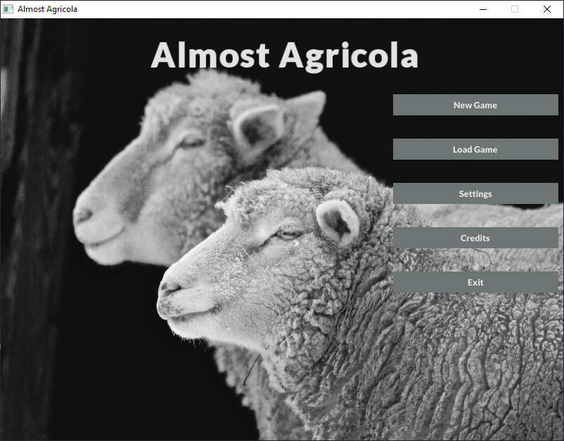

[](https://travis-ci.com/ArturBa/AlmostAgricola)
[](https://codecov.io/gh/ArturBa/AlmostAgricola)


# Almost Agricola
available on your Linux and PC

# What is this?
This is a game based on Agricola 

# Table of Contents
1. [What is this?](#what-is-this)
1. [Project structure](#project-structure)
1. [Project dependencies](#project-dependencies)
1. [Project building](#project-building)
1. [Game show](#game-show)
1. [Documentation](#documentation)

# Project structure
- [`docs/`](./docs) is where documentation is
- [`ext/`](./ext) includes project dependencies
- [`inlude/`](./include) is where the header files are located
- [`src/`](./src) is where the source files are located
- [`test/`](./test) is where the test source files are located


# Project dependencies
This project uses:
- [`Google Test`](https://github.com/google/googletest) for testing purposes 
- [`ImGui`](https://github.com/ocornut/imgui) + [`SFML`](https://www.sfml-dev.org/) for GUI

# Project building 
## Linux
In the project root:

    mkdir build
    cd build
    cmake ..
    make

### Run executables
Then you can do ./executable for the generated executable:

    ./AlmostAgricola
    
## Windows
Will be added later

# Game show
### Main menu


# Documentation
## Doxygen
To create [Doxygen](http://doxygen.nl/) documentation run in project root:
```bash
doxygen Doxyfile
```
Then you will find [`index.html`](docs/html/index.html) file
```bash
docs/html/index.html
```
## UML
UML diagram available in:
[`docs/UML`](docs/UML/README.md)


